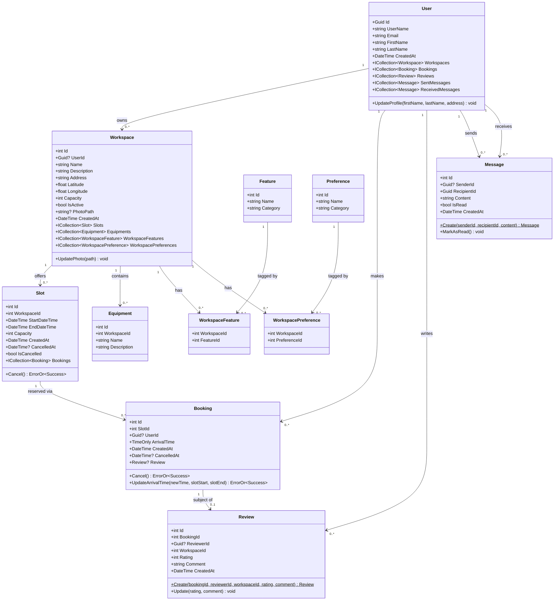

```mermaid
classDiagram
    class User {
        +Guid Id
        +string UserName
        +string Email
        +string FirstName
        +string LastName
        +DateTime CreatedAt
        +ICollection~Workspace~ Workspaces
        +ICollection~Booking~ Bookings
        +ICollection~Review~ Reviews
        +ICollection~Message~ SentMessages
        +ICollection~Message~ ReceivedMessages
        +UpdateProfile(firstName, lastName, address) void
    }

    class Workspace {
        +int Id
        +Guid? UserId
        +string Name
        +string Description
        +string Address
        +float Latitude
        +float Longitude
        +int Capacity
        +bool IsActive
        +string? PhotoPath
        +DateTime CreatedAt
        +ICollection~Slot~ Slots
        +ICollection~Equipment~ Equipments
        +ICollection~WorkspaceFeature~ WorkspaceFeatures
        +ICollection~WorkspacePreference~ WorkspacePreferences
        +UpdatePhoto(path) void
    }

    class Feature {
        +int Id
        +string Name
        +string Category
    }

    class WorkspaceFeature {
        +int WorkspaceId
        +int FeatureId
    }

    class Preference {
        +int Id
        +string Name
        +string Category
    }

    class WorkspacePreference {
        +int WorkspaceId
        +int PreferenceId
    }

    class Equipment {
        +int Id
        +int WorkspaceId
        +string Name
        +string Description
    }

    class Slot {
        +int Id
        +int WorkspaceId
        +DateTime StartDateTime
        +DateTime EndDateTime
        +int Capacity
        +DateTime CreatedAt
        +DateTime? CancelledAt
        +bool IsCancelled
        +ICollection~Booking~ Bookings
        +Cancel() ErrorOr~Success~
    }

    class Booking {
        +int Id
        +int SlotId
        +Guid? UserId
        +TimeOnly ArrivalTime
        +DateTime CreatedAt
        +DateTime? CancelledAt
        +Review? Review
        +Cancel() ErrorOr~Success~
        +UpdateArrivalTime(newTime, slotStart, slotEnd) ErrorOr~Success~
    }

    class Review {
        +int Id
        +int BookingId
        +Guid? ReviewerId
        +int WorkspaceId
        +int Rating
        +string Comment
        +DateTime CreatedAt
        +Create(bookingId, reviewerId, workspaceId, rating, comment)$ Review
        +Update(rating, comment) void
    }

    class Message {
        +int Id
        +Guid? SenderId
        +Guid RecipientId
        +string Content
        +bool IsRead
        +DateTime CreatedAt
        +Create(senderId, recipientId, content)$ Message
        +MarkAsRead() void
    }

    User "1" --> "0..*" Workspace : owns
    User "1" --> "0..*" Booking : makes
    User "1" --> "0..*" Review : writes
    User "1" --> "0..*" Message : sends
    User "1" --> "0..*" Message : receives

    Workspace "1" --> "0..*" Slot : offers
    Workspace "1" --> "0..*" Equipment : contains
    Workspace "1" --> "0..*" WorkspaceFeature : has
    Workspace "1" --> "0..*" WorkspacePreference : has

    Feature "1" --> "0..*" WorkspaceFeature : tagged by
    Preference "1" --> "0..*" WorkspacePreference : tagged by

    Slot "1" --> "0..*" Booking : reserved via
    Booking "1" --> "0..1" Review : subject of
```
