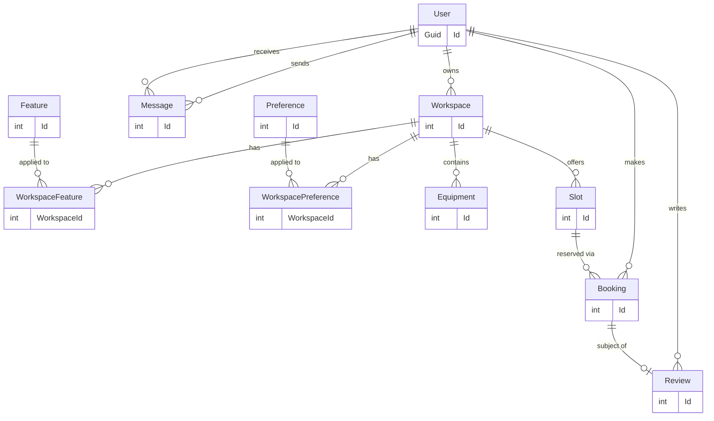

```mermaid
erDiagram
    User         ||--o{ Workspace            : owns
    User         ||--o{ Booking              : makes
    User         ||--o{ Review              : writes
    User         ||--o{ Message             : sends
    User         ||--o{ Message             : receives

    Workspace    ||--o{ WorkspaceFeature    : has
    Feature      ||--o{ WorkspaceFeature    : "applied to"
    Workspace    ||--o{ WorkspacePreference : has
    Preference   ||--o{ WorkspacePreference : "applied to"
    Workspace    ||--o{ Equipment           : contains
    Workspace    ||--o{ Slot                : offers

    Slot         ||--o{ Booking             : "reserved via"
    Booking      ||--o| Review              : "subject of"

    User          { Guid Id }
    Workspace     { int Id }
    Feature       { int Id }
    WorkspaceFeature { int WorkspaceId }
    Preference    { int Id }
    WorkspacePreference { int WorkspaceId }
    Equipment     { int Id }
    Slot          { int Id }
    Booking       { int Id }
    Review        { int Id }
    Message       { int Id }
```
