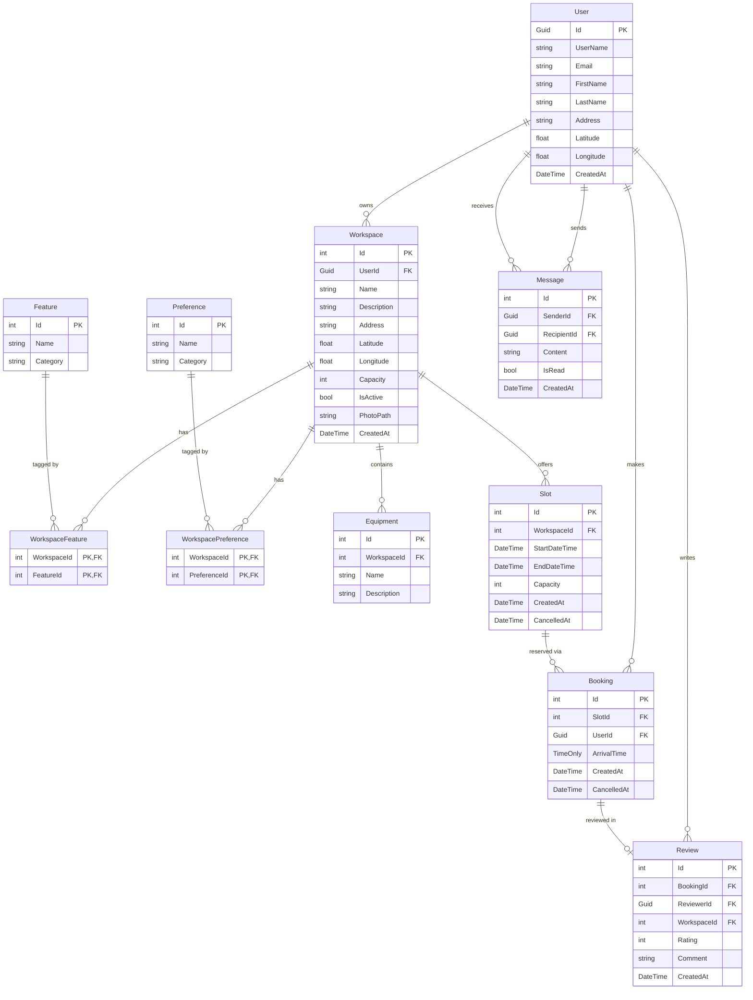

```mermaid
erDiagram
    User {
        Guid    Id          PK
        string  UserName
        string  Email
        string  FirstName
        string  LastName
        string  Address
        float   Latitude
        float   Longitude
        DateTime CreatedAt
    }

    Workspace {
        int     Id          PK
        Guid    UserId      FK
        string  Name
        string  Description
        string  Address
        float   Latitude
        float   Longitude
        int     Capacity
        bool    IsActive
        string  PhotoPath
        DateTime CreatedAt
    }

    Feature {
        int    Id   PK
        string Name
        string Category
    }

    WorkspaceFeature {
        int WorkspaceId PK,FK
        int FeatureId   PK,FK
    }

    Preference {
        int    Id   PK
        string Name
        string Category
    }

    WorkspacePreference {
        int WorkspaceId PK,FK
        int PreferenceId PK,FK
    }

    Equipment {
        int    Id          PK
        int    WorkspaceId FK
        string Name
        string Description
    }

    Slot {
        int      Id          PK
        int      WorkspaceId FK
        DateTime StartDateTime
        DateTime EndDateTime
        int      Capacity
        DateTime CreatedAt
        DateTime CancelledAt
    }

    Booking {
        int      Id        PK
        int      SlotId    FK
        Guid     UserId    FK
        TimeOnly ArrivalTime
        DateTime CreatedAt
        DateTime CancelledAt
    }

    Review {
        int    Id          PK
        int    BookingId   FK
        Guid   ReviewerId  FK
        int    WorkspaceId FK
        int    Rating
        string Comment
        DateTime CreatedAt
    }

    Message {
        int      Id          PK
        Guid     SenderId    FK
        Guid     RecipientId FK
        string   Content
        bool     IsRead
        DateTime CreatedAt
    }

    User         ||--o{ Workspace            : "owns"
    User         ||--o{ Booking              : "makes"
    User         ||--o{ Review              : "writes"
    User         ||--o{ Message             : "sends"
    User         ||--o{ Message             : "receives"
    Workspace    ||--o{ WorkspaceFeature    : "has"
    Feature      ||--o{ WorkspaceFeature    : "tagged by"
    Workspace    ||--o{ WorkspacePreference : "has"
    Preference   ||--o{ WorkspacePreference : "tagged by"
    Workspace    ||--o{ Equipment           : "contains"
    Workspace    ||--o{ Slot                : "offers"
    Slot         ||--o{ Booking             : "reserved via"
    Booking      ||--o| Review              : "reviewed in"
```
